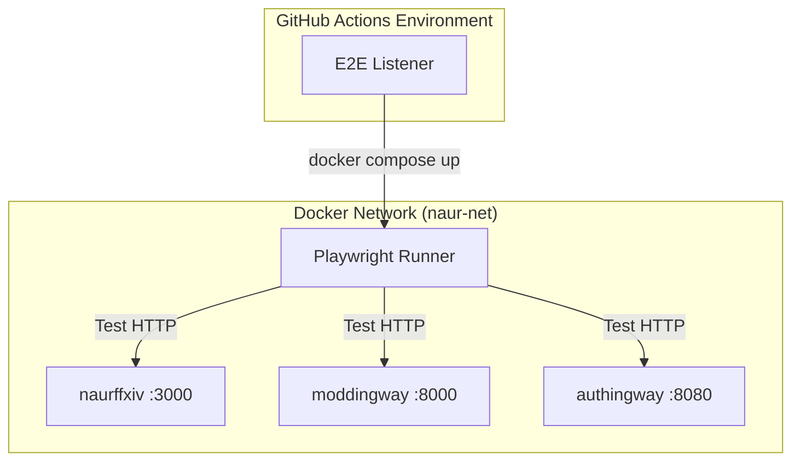
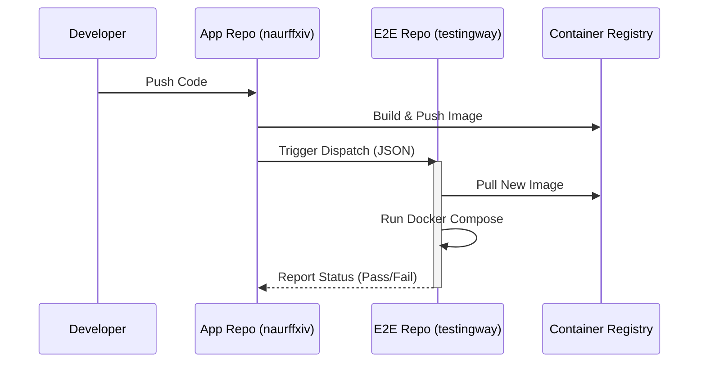

# Testingway (E2E)

Automated End-to-End testing suite for the NaurFFXIV ecosystem.

## Architecture



## Run (Auto-Cleanup)

```bash
docker compose up --build --abort-on-container-exit

```

## CI Trigger (cURL)

### Example: Triggering from moddingway's workflow

When `moddingway` builds a new version, it triggers E2E tests with its fresh image while using stable versions of other services.

*Requires `PAT_TOKEN` with `repo` scope.*

### CI/CD Flow



### Command

```bash
curl -X POST \
  -H "Authorization: token ${{ secrets.PAT_TOKEN }}" \
  -H "Accept: application/vnd.github+json" \
  https://api.github.com/repos/naurffxiv/testingway/dispatches \
  -d '{
    "event_type": "trigger-e2e-check",
    "client_payload": {
      "repo_name": "naurffxiv/moddingway",
      "commit_sha": "${{ github.sha }}",
      "naurffxiv_image": "ghcr.io/naurffxiv/naurffxiv:latest",
      "moddingway_image": "ghcr.io/naurffxiv/moddingway:${{ github.sha }}",
      "authingway_image": "ghcr.io/naurffxiv/authingway:latest"
    }
  }'

```

## Env Vars

`NAURFFXIV_URL`, `MODDINGWAY_URL`, `AUTHINGWAY_URL`
`NAURFFXIV_IMAGE`, `MODDINGWAY_IMAGE`, `AUTHINGWAY_IMAGE`
